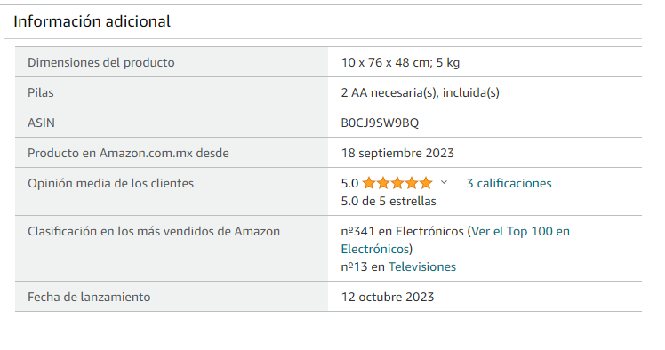

# Análisis de productos vendidos por medio de e-commerce: Caso de Amazon

## Introducción

En los ultimos años el comercio electronico se ha vuelto el canal de compra preferido por millones de personas, desde comprar el super hasta automoviles, tal es el caso que en México para el año 2022 el valor de este tipo de comercio superaba los 33.000 millones de dolares, siendo el segundo más importante a nivel mundial solo por encima de Brasil. 

Según datos de Amazon, en abril del 2023 contaba con casí 18 mil vendedores independientes, de los cuales 99 % eran PyMes, las que tienen un estimado de 3 millones de productos en venta en esta plataforma. Por ello este análisis se centra en la manera en que una empresa o PyMe, pueede revisar el título, calificaicón y comentarios de sus prodcutos por medio de web scraping, y análisis de lenguaje natural. 

## Desarrollo

Para poder comnzar con  el análisis de los productos, primero hay que identificar el ASIN (Amazon Standard Identification Number) de este, por lo general cada empresa ya cuenta con su listado de ASIN proporcionado por Amazón para cada producto que se encuentra en  venta en su plataforma, de no contar con el, puede ser consultado en la página de cada uno de los productos en el apartado de descripcion del mismo (como se muestra en la imagen). 

### Scrapping 

## Conclusión

#

## Referencias 
[Numeralia de Amazon](https://vender.amazon.com.mx/sellerblog/amazon-conecta#:~:text=Ciudad%20de%20M%C3%A9xico%2C%2027%20de%20abril%20de%202023.&text=Actualmente%2C%20Amazon%20M%C3%A9xico%20cuenta%20con,57%2C000%20empleos%20directos%20e%20indirectos.)

[PCMI](https://paymentscmi.com/our-services/latin-america-e-commerce-digital-payments-data/?utm_source=Website&utm_medium=AMI+site)

[Americas Market Inteligence](https://americasmi.com/insights/lo-que-mas-compran-los-mexicanos-por-internet/)

